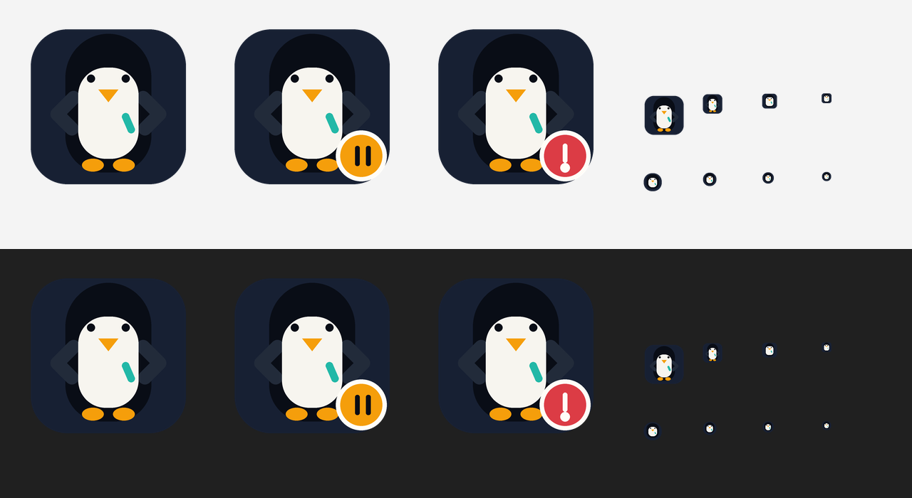

# Fcitx5 for Windows Next

[](https://github.com/0x696c757a696f/fcitx5-windows-next/actions/workflows/core.yml)
[](#成熟度与范围)
[](#环境要求)
[](#架构)
[](LICENSE)

[English](README.md) | [简体中文](README.zh-CN.md)



**面向 Windows 的原生 Fcitx5 前端与发行层。**

Fcitx5 for Windows Next 将 Fcitx5 输入法接入 Windows Text Services Framework（TSF），提供受监督的进程边界、原生候选体验，以及正在演进中的配置、软件包、插件和主题管理能力。

> [!WARNING]
> **开发者预览版：** 本仓库仍在持续演进，尚不是生产就绪发行版。真实宿主 TSF、无障碍、安装器/UAC、在线插件生命周期、生产签名和 Windows 版本矩阵证据仍是发布门槛。

## 当前内容

- Fcitx5 Core 仍是输入法和 addon 语义的权威来源。拼音、Rime、Mozc 等输入法是 Fcitx addon，而不是分别注册的 Windows TSF 配置文件。
- 正式 TSF 边界由 Rust 实现，并在输入路径周围提供有界 IPC 和 fail-soft 行为。
- 候选数据、布局、交互、主题和预览契约由 Rust 持有；候选窗口按需显示，不直接向宿主应用提交文字。
- Rust 配置、软件包、更新、控制、启动器和策略核心提供产品逻辑基础。设置迁移和事务能力仍在任务队列中推进。
- 插件和主题管理模型正在开发中。官方公开在线目录以及完整的安装、更新、回滚和卸载生命周期目前尚未提供。

## 架构

```text
Windows 宿主
    |
    v
fcitx5-tsf.dll       Rust TSF 边界；有界 IPC；fail-soft 行为
    |
    v
fcitx5-launcher.exe  生命周期与进程监督
    |
    v
fcitx5-engine.exe    Fcitx5 Core 与直接 addon/config 集成
    |
    v
fcitx5-ui.exe        按需显示的候选窗口
```

产品自有的 Windows 状态、校验、操作、解析、软件包/更新逻辑、候选语义和 UI 领域行为默认使用 Rust。C++ 被有意限制在直接 Fcitx 对象集成以及薄的原生/Windows 适配层。旧的权威 C++ TSF 实现已经移除。

输入平面没有网络能力。网络访问属于隔离的下载器边界，不能接收预编辑文本、候选项、按键事件或提交历史。防御性安全模型和报告方式见 [`SECURITY.md`](SECURITY.md)。

## 成熟度与范围

这是用于开发和评估的技术预览版。自动化测试和本地构件检查不能证明已经达到发行条件。本仓库目前不声称具备：

- 生产级 Authenticode 或软件包仓库签名计划；
- 已公开的官方插件目录或在线插件生命周期；
- 已完成的 Narrator 或 NVDA 证据；
- 已验证的 Windows 7、Windows 10 或 Windows 11 真实宿主矩阵；
- 已完成的安装器、升级、卸载或 UAC 能力；
- 原生 ARM64 Fcitx 引擎支持。

## 环境要求

- Windows 开发主机
- Visual Studio 2022，并安装 MSVC C++ x86/x64 工具和 ATL（`Microsoft.VisualStudio.Component.VC.ATL`）
- CMake 3.29 或更高版本
- PowerShell 7
- 仓库准备好的 Rust 工具链

运行 `./tools/build.ps1 bootstrap`，即可准备和管理仓库 `out/toolchains` 下的本地工具链。生成的构建和软件包输出不是提交到仓库的发行资产。

## 构建与测试

在仓库根目录使用 PowerShell 7 执行：

```powershell
./tools/build.ps1 bootstrap
./tools/build.ps1 dev
./tools/build.ps1 test
```

需要时可指定架构：

```powershell
./tools/build.ps1 dev -Architecture x64
./tools/build.ps1 test -Architecture x86
```

接近发行形态的软件包命令要求所有支持的原生构建通道并使用 Release 配置：

```powershell
./tools/build.ps1 package -Architecture all -Configuration Release
```

`test` 会运行配置好的 CTest 和策略检查。CI 还包含 ARM64 交叉构建/静态检查通道；该通道不代表原生 Fcitx 引擎支持承诺。

## 项目地图

| 路径 | 用途 |
| --- | --- |
| `rust/` | Rust 产品核心、CLI、TSF、Config、Candidate、软件包和策略代码 |
| `src/` | Windows 原生代码及直接 Fcitx 集成适配器 |
| `protocol/` | 薄的协议编组边界 |
| `tools/` | 引导、构建、打包、验证和审计脚本 |
| `docs/` | 工程规格和任务证据 |
| `resources/` | 图标及其他项目资源 |

工程队列和当前实现事实以 [`docs/tasks/current.md`](docs/tasks/current.md)、[`docs/tasks/PLAN.md`](docs/tasks/PLAN.md) 和 [`docs/current.md`](docs/current.md) 为准。修改代码前请阅读 [`AGENTS.md`](AGENTS.md)。安全报告方式见 [`SECURITY.md`](SECURITY.md)，依赖声明见 [`THIRD_PARTY_NOTICES.md`](THIRD_PARTY_NOTICES.md)。

根项目采用 **GNU GPL version 3 或任何更高版本**，详见 [`LICENSE`](LICENSE)。部分可复用 Rust crate 声明为 `LGPL-2.1-or-later`，第三方组件继续遵守各自许可证。每个组件适用的许可证以其许可证文件和 [`THIRD_PARTY_NOTICES.md`](THIRD_PARTY_NOTICES.md) 为准。
